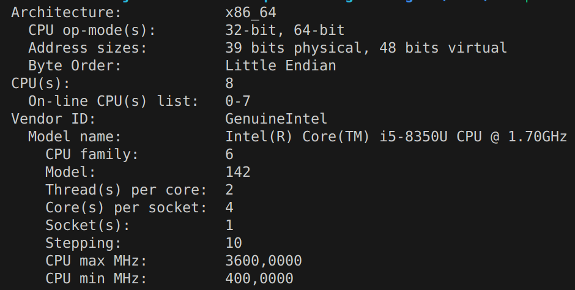

# CSE305-Project-Parallel-sequence-alignment
The goal of the project is to implement two recent parallel algorithms (Needleman-Wunsch & Smith-Waterman) for sequence alignment and test their performance on real-life data.

To compile on mac (example):

```
g++ nw.cpp -o nw -std=c++11 -lpthread
./nw ../tests/big/midacin/H2QTE8.fasta ../tests/big/midacin/Q9NU22.fasta
```

AND 

### To Run the Smith-Waterman Algorithm:

The tests were run on a Microsoft Surface Book. The specifics of the computer are as such:
This is the video card: Intel Corporation UHD Graphics 620 (rev 07)
And these are the important facts about the card:


To run the file, you must work only on the final_sw.cpp file (the again_sw.cpp file was used to test various functions and structure for the algorithm).
Similarly to the way we ran in in class in the terminal write:

```
g++ final_sw.cpp -o final_sw
./final_sw file1 file2 int
```

Where file1 and file2 are .fasta files that contain a sequence of amino acids and int is the number of threads you want to run the algorithm on.
For example:

```
g++ final_sw.cpp -o final_sw
./final_sw "tests/big/fibronectin/P02751.fasta" "tests/big/fibronectin/P07589.fasta" 64
``` 
